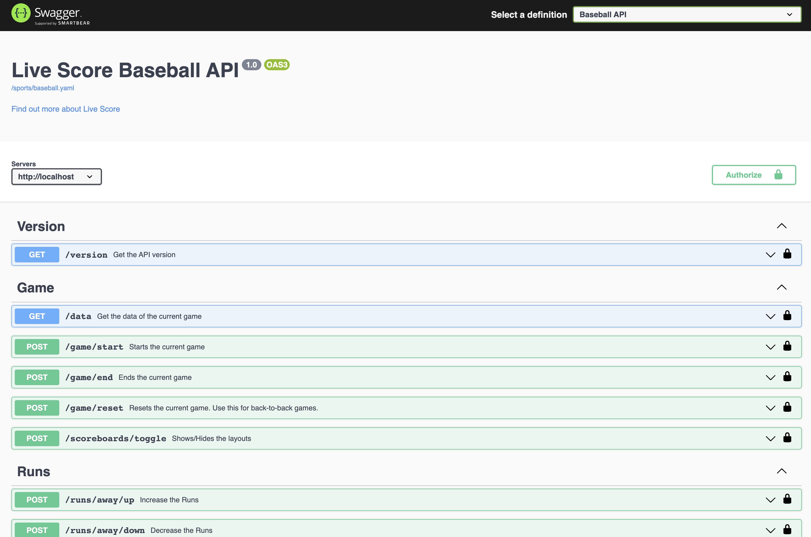

# Live Score API Documentation

This is the official documentation of the Live Score API.

The API is integrated in the Live Score Desktop App (www.live-score-app.com) and available as HTTP REST Api.


## Authorization

You can create a custom Authorization Token within the Desktop App of Live Score.

If you build a custom client using our REST API, please send this token as "Authorization" header within every single request.


## Versioning

Every sport has its own version.

The current version of the Desktop App can be asked with a simple `/version` request.

Please use this repository, to get the correct documentation for the matching Live Score Desktop App version.


## Swagger Setup

To allow you an easy playground experience, we've integrated a full Swagger setup for every single sport.
Just start the Swagger Docker container with the prepared `docker-compose.yml` file.


### Start Swagger
Open the terminal in the same folder as that file, and (if Docker is already installed on your machine)
just run this command.

```ruby 
docker-compose up -d
```

This will download the Docker image and start the container.

Once started, the Swagger API documentation is available at http://localhost





### Use Swagger

You can use the dropdown in the top right area of Swagger to select your sport.
Please also open this sport inside the Live Score Desktop App.

Set a custom Authorization Token in the Live Score Desktop App, enable the API and start everything with the blue start button.
Now add this token to Swagger by using the Authorize button on the top of the page.

You can now simply open every request, click on "Try it out" and execute the request.

Simple POST requests should automatically trigger an action within Live Score.

Some commands however, require additional data, which need to be sent as JSON payload.
These commands already show a prepared JSON structure, that you can adjust before executing the request.


